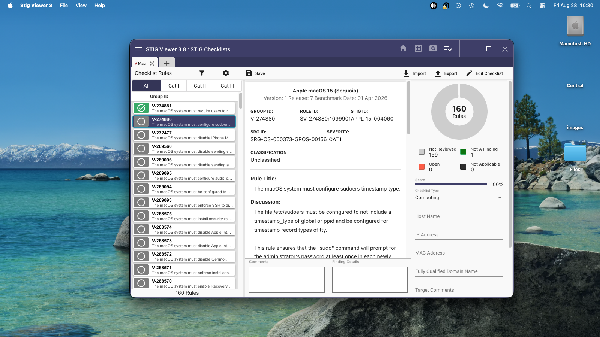

# STIGViewer3-Mac
A repackaging of STIG Viewer 3 for Linux with needed Mac dependencies. The app is a Node.JS native app, and is just missing a sqlite driver. The app is signed and notarized to open on a Mac.

> [!WARNING]
> I am making no claim to rights to the application, I could not find a LICENSE file other than the default Node license for the application, and I wanted to help those who need STIG Viewer 3 on the Mac. I hope this helps build an official Mac version.

Releases are in the [repo](https://github.com/daberkow/STIGViewer3-Mac/releases)!

## Process

I get the Linux version from cyber.mil, extract the files for the application, add the sqlite driver for Mac, repackage, create a .app, and sign it. [bundle.sh](./bundle.sh) contains all the details!
